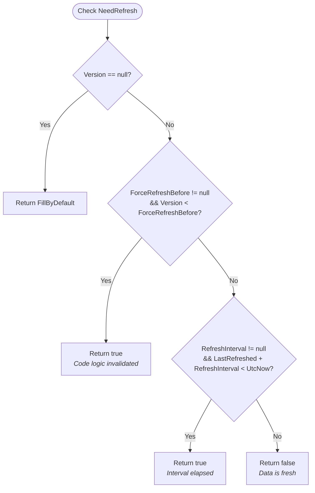

# Versioning and Freshness System

This document describes the design, architecture, and backward compatibility strategy of the date-based versioning and data freshness subsystem in KifaNet.

---

## 1. Background & Motivation

In previous iterations, KifaNet relied on integer version numbers (`int Version`, `int CurrentVersion`) coupled with serialized freshness metadata (`$metadata.freshness.next_refresh`) stored inside JSON data files:

```json
{
  "id": "sample_item",
  "$metadata": {
    "version": 18,
    "freshness": {
      "next_refresh": "2024-05-01T12:00:00+00:00"
    }
  }
}
```

This model posed several architectural limitations:
1. **Integer version maintenance overhead**: Developers had to manually bump `CurrentVersion` across classes whenever parsing logic changed.
2. **Coarse-grained dependency freshness**: Downstream models (e.g., dictionary words aggregating DWDS, Cambridge, or Wiktionary sources) could not inspect whether individual upstream sources had actually changed or simply run through a routine check.
3. **Data polluted with scheduling state**: Transient scheduling timestamps (`next_refresh`) were persisted to git/disk, creating spurious file diffs even when data contents remained identical.
4. **Unnecessary downstream cascading**: Forcing a refresh on an item whose content remained identical would still trigger cascading updates in dependent models.

---

## 2. Core Architecture

The reworked system transitions from arbitrary integer versions and stored schedules to a **date-based, two-timestamp model** where refresh scheduling is strictly code-managed and multi-source models independently check upstream freshness within `Fill()`.

### 2.1 Two-Timestamp Separation in `DataMetadata`

Metadata tracks two distinct timestamps:

1. **`Version` (`DateTimeOffset?`)**:
   - Represents the timestamp when the content was last *modified* (or when code logic changes invalidated older content).
   - Serves as the content version.
   - Only changes when:
     - The item is initially created/filled (`Version == null`).
     - A code logic change occurs (`ForceRefreshBefore > Version`).
     - A refresh operation produces actual content changes (`!data.Equals(original)`).

2. **`LastRefreshed` (`DateTimeOffset?`)**:
   - Represents the timestamp when the item was last checked/verified against its upstream sources.
   - Automatically updated to `DateTimeOffset.UtcNow` every time `Fill()` completes successfully.
   - Falls back to `Version` if not explicitly set (`lastRefreshed ?? Version`).

### 2.2 JSON Serialization Optimization

To keep data files clean and minimal:
- If `LastRefreshed == Version` (or null), `LastRefreshed` is **omitted** from serialized JSON (`ShouldSerializeLastRefreshed()`).
- `LastRefreshed` is only written to JSON if the item was checked and verified without any changes to its underlying content (`lastRefreshed != null && lastRefreshed != Version`).
- The entire `$metadata.freshness` object is eliminated.

Example persisted JSON:
```json
{
  "id": "sample_item",
  "$metadata": {
    "version": "2026-08-29T00:00:00.000000+00:00"
  }
}
```

---

## 3. Data Freshness & Refresh Scheduling

Whether a data model needs refreshing is determined dynamically by `data.NeedRefresh()`:



### 3.1 Code-Managed Invalidation (`ForceRefreshBefore`)

When parsing or scraping logic changes significantly in code:
```csharp
public class DwdsPage : DataModel, WithModelId<DwdsPage> {
    public override DateTimeOffset? ForceRefreshBefore =>
        new DateTimeOffset(2026, 8, 29, 0, 0, 0, TimeSpan.Zero);
}
```
Any item with `Version < ForceRefreshBefore` is treated as stale. Upon retrieval, it is automatically re-filled, and its `Version` is bumped to the current timestamp.

### 3.2 Code-Managed Refresh Interval (`RefreshInterval`)

For models with dynamic lifespans (e.g. cloud accounts, quotas, live program schedules):
```csharp
public class BaiduAccount : DataModel, WithModelId<BaiduAccount> {
    public override TimeSpan? RefreshInterval => TimeSpan.FromDays(7);
}
```
The next refresh timestamp is computed on demand via `GetNextRefresh()`:
$$\text{NextRefresh} = (\text{LastRefreshed} \mathbin{??} \text{Version}) + \text{RefreshInterval}$$

### 3.3 Non-Upstream Models (e.g., `FileInformation`)

Models representing user data or metadata without external upstream sources (such as `FileInformation`) do not override `FillByDefault` (remains `false`) and do not implement `Fill()`:
- `data.NeedRefresh()` immediately returns `false` (via `data.FillByDefault`).
- No `$metadata` (such as `Version` or `LastRefreshed`) is generated or written to disk.
- `CleanupForWriting()` strips empty metadata objects, keeping the on-disk JSON file pure and free of unnecessary metadata fields.
- If a client explicitly passes `refresh: true` for such a model, `DataModel.Fill()` throws `NoNeedToFillException`, which `KifaServiceJsonClient` catches cleanly without modifying metadata.

---

## 4. Region-Based Upstream Freshness Checks in `Fill()`

Rather than relying on framework-level dependency cascades, downstream models check upstream freshness **within `Fill()` per region/source** using `NeedRefreshFrom()`:

```csharp
public virtual bool NeedRefreshFrom(DataModel? upstream)
    => NeedRefreshFrom(upstream?.Metadata?.Version);

public virtual bool NeedRefreshFrom(DateTimeOffset? upstreamVersion) {
    if (Metadata?.Version == null) {
        return true;
    }

    if (ForceRefreshBefore != null && Metadata.Version < ForceRefreshBefore) {
        return true;
    }

    if (upstreamVersion == null) {
        return true;
    }

    return upstreamVersion > Metadata.Version;
}
```

### 4.1 Granular Multi-Source Filling

Composite models (e.g. `GermanWord`, `GoetheGermanWord`, `DwdsGermanWord`) selectively refresh only the regions whose upstream sources have changed:

```csharp
public class GoetheGermanWord : DataModel, WithModelId<GoetheGermanWord> {
    public override void Fill() {
        var word = GermanWord.Client.Get(RootWord);
        if (word == null) {
            throw new UnableToFillException($"Failed to find root word ({RootWord}) for {Id}.");
        }

        // Region 1: Base German word details
        if (NeedRefreshFrom(word)) {
            Form = word.KeyForm;
            Meaning = word.Meaning;
            Wiki = string.Join("; ", word.Meanings.Select(m => m.Translation)).Trim();
        }

        // Region 2: Cambridge definitions
        var cambridge = CambridgeGlobalGermanWord.Client.Get(RootWord);
        if (cambridge != null && NeedRefreshFrom(cambridge)) {
            Cambridge = string.Join("; ",
                cambridge.Entries
                    .SelectMany(e => e.Senses.Select(s => s.Definition?.Translation?.Trim()))
                    .ExceptNull().Where(x => x != "").Distinct()).Trim();
        }
    }
}
```

### 4.2 Benefits of In-Fill Region Checks
1. **No unnecessary computation**: Unchanged HTML pages or remote API responses are not re-parsed.
2. **Version preservation**: If a routine scheduled check executes but no upstream source has updated, all regions are skipped. `Equals` confirms identical content, so the downstream `Version` remains untouched while `LastRefreshed` is updated to reset the timer.
3. **Selective updates**: When one upstream source (e.g. DWDS) updates but others (e.g. Cambridge) remain the same, only the modified region is refreshed.

---

## 5. Fill Lifecycle & Content Equality

When `KifaServiceJsonClient.Fill(ref data, refresh)` executes:

```csharp
var isNewItem = data.Metadata?.Version == null;
var isCodeLogicChange = data.ForceRefreshBefore != null &&
                        (data.Metadata?.Version == null || data.Metadata.Version < data.ForceRefreshBefore);

var originalContent = data.Clone();
data.Fill();

var contentChanged = isNewItem || isCodeLogicChange || !data.Equals(originalContent);
var now = DateTimeOffset.UtcNow;

data.Metadata ??= new DataMetadata();
data.Metadata.LastRefreshed = now;

if (contentChanged) {
    data.Metadata.Version = now;
}
```

### Content Equality (`IEquatable<DataModel>`)

`DataModel` implements `IEquatable<DataModel>` by comparing its canonical serialized JSON representation ignoring `$metadata`:
```csharp
public string ToDataJson() => this.ToJson(KifaJsonSerializerSettings.DataContent);

public virtual bool Equals(DataModel? other) {
    if (other is null) return false;
    if (ReferenceEquals(this, other)) return true;
    if (GetType() != other.GetType()) return false;
    return ToDataJson() == other.ToDataJson();
}
```
- Custom `OrderedContractResolver.IgnoredProperties` excludes `$metadata` from `ToDataJson()`.
- Sorting is deterministic because `OrderedContractResolver` orders all JSON properties alphabetically.
- Content equality check is fast, clean, and avoids complex tree diffing.

---

## 6. Backward Compatibility & Rollout

### 6.1 Legacy JSON Compatibility
Existing data files on disk may contain legacy metadata:
- `"version": 18` (integer)
- `"freshness": { "next_refresh": "..." }`

The custom `DataMetadataVersionJsonConverter`:
1. Reads string ISO-8601 timestamps (e.g. `"2026-08-29T00:00:00+00:00"`).
2. If an integer or null token is encountered, returns `null`.

When a legacy file is read:
1. `Metadata.Version` resolves to `null`.
2. `NeedRefresh()` detects `Version == null` and triggers `Fill()`.
3. The newly filled item receives `Version = UtcNow` and `LastRefreshed = UtcNow`.
4. The legacy `"freshness"` block is completely ignored by deserialization and omitted on save.
5. The saved JSON file is cleanly migrated to the new schema with zero manual database migration required.

### 6.2 Rollout Summary
- **No breaking changes** to client callers or REST APIs.
- **Zero data migration scripts** needed.
- **Gradual lazy migration**: files are updated to the modern date-based format as they are accessed or refreshed.
