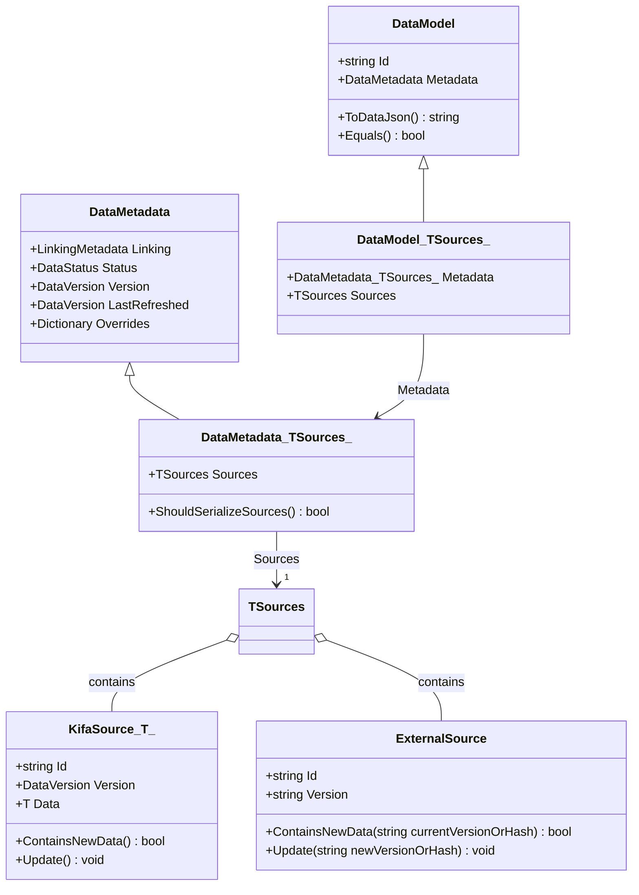

# Typed Sources and Freshness Tracking Design

**Date:** 2026-09-10  
**Status:** Proposed / Approved for Implementation  
**Target Projects:** `Kifa.Service`, `Kifa.Web.Api`, `Kifa.Languages.*`, `Kifa.Infos`, `Kifa.YouTube`, `Kifa.Bilibili`, `Kifa.SkyCh`, `Kifa.Tools.DataUtil`

---

## 1. Motivation and Problem Statement

### 1.1 Provenance, Multi-Source Dependencies, and External IDs
In KifaNet, data models frequently aggregate information from multiple distinct origins, fallback scrapers, or external metadata providers:
1. **Multi-Model Aggregation:** `GoetheGermanWord` pulls definition and grammar data from `GermanWord`, and Cambridge translations from `CambridgeGlobalGermanWord`.
2. **Hybrid Aggregation:** `GermanWord` merges upstream Kifa models (`DwdsGermanWord`) with external web sources (Wiktionary, Duden).
3. **Fallback Chains:** `YouTubeVideo` attempts retrieval from `youtube_dl` first, falling back to Internet Archive (`ia`), and finally to Wayback Machine snapshots. `BilibiliVideo` falls back from official Bilibili API to Biliplus / BiliplusCache.
4. **External Provider IDs:** `TvShow` and `Anime` store external IDs like `TmdbId`, `TvdbId`, and query remote APIs during `Fill()`.

### 1.2 Limitations of the Previous Approach
1. **Lack of Granular Provenance:** There was no structured record in `$metadata` detailing which specific upstream versions, snapshot timestamps, or tool versions contributed to each field.
2. **All-or-Nothing Refreshes:** In multi-source models, if one source updated (e.g. Cambridge added a new definition), the model had no way to selectively refresh only the Cambridge section while skipping already up-to-date DWDS/Wiktionary sections without losing source attribution.
3. **Folder Structure Coupling:** Using storage paths (`ModelId`) as source identifiers tied data provenance to folder structures, breaking references if storage folders were reorganized.
4. **Field Redundancy & Dispersion:** External IDs (`TmdbId`, `TvdbId`, `BiliplusId`, `ArchiveId`) were scattered as ad-hoc fields across models rather than unified under metadata provenance.

---

## 2. Core Architecture

The typed source system introduces four primary abstractions:
1. **`KifaSource<TDataModel>`**: A typed link for upstream Kifa `DataModel`s containing `{ Id, Version, Data }`.
2. **`ExternalSource`**: A typed structure for non-DataModel sources (TMDB, TVDB, Wayback snapshots, Internet Archive items, scrapers, tools) containing `{ Id, Version }`.
3. **`DataMetadata<TSources>`**: A generic extension of `DataMetadata` hosting the strongly-typed `Sources` object inside `$metadata.sources`.
4. **`DataModel<TSources>`**: A generic base class providing downstream models with a first-class `Sources` property.



---

## 3. Detailed Component Specifications

### 3.1 `KifaSource<TDataModel>`
Encapsulates an upstream Kifa `DataModel` dependency. Mirroring `Link<TDataModel>`, it provides lazy evaluation and cached access, while tracking the specific `DataVersion` incorporated into the downstream model:

```csharp
public class KifaSource<TDataModel> : JsonSerializable, IEquatable<KifaSource<TDataModel>>
    where TDataModel : DataModel, WithModelId<TDataModel> {

    public required string Id { get; init; }

    public DataVersion? Version { get; set; }

    TDataModel? data;

    [JsonIgnore]
    [YamlIgnore]
    public TDataModel? Data {
        get {
            if (data == null || data.NeedRefresh()) {
                data = TDataModel.Client.Get(Id);
            }
            return data;
        }
        set => data = value;
    }

    // Checks if upstream data has been modified since this source was last incorporated.
    public bool ContainsNewData() {
        if (Version == null) {
            return true;
        }

        if (Data?.Metadata?.Version == null) {
            return false;
        }

        return Data.Metadata.Version > Version;
    }

    // Commits current upstream version to this source link.
    public void Update() {
        if (Data?.Metadata?.Version != null) {
            Version = Data.Metadata.Version;
        }
    }

    [return: NotNullIfNotNull(nameof(id))]
    public static implicit operator KifaSource<TDataModel>?(string? id)
        => id == null ? null : new KifaSource<TDataModel> { Id = id };

    public static implicit operator KifaSource<TDataModel>?(TDataModel? data)
        => data == null || data.Id == null
            ? null
            : new KifaSource<TDataModel> {
                Id = data.Id,
                Version = data.Metadata?.Version,
                Data = data
            };

    public static implicit operator string?(KifaSource<TDataModel>? source) => source?.Id;
    public static implicit operator TDataModel?(KifaSource<TDataModel>? source) => source?.Data;

    public bool Equals(KifaSource<TDataModel>? other) {
        if (other is null) return false;
        if (ReferenceEquals(this, other)) return true;
        return Id == other.Id && Version == other.Version;
    }

    public override bool Equals(object? obj) => Equals(obj as KifaSource<TDataModel>);
    public override int GetHashCode() => HashCode.Combine(Id, Version);
}
```

---

### 3.2 `ExternalSource`
Encapsulates non-DataModel sources (e.g. TMDB IDs, TVDB IDs, Wayback snapshot URLs, archive IDs, raw web scrapers, CLI tools):

```csharp
public class ExternalSource : JsonSerializable, IEquatable<ExternalSource> {
    public required string Id { get; init; }

    // Version can represent a snapshot timestamp (e.g. "20180415123000"),
    // a sync date (e.g. "20260901"), a content hash (e.g. "sha256:abc..."), or a tool version.
    public string? Version { get; set; }

    public bool ContainsNewData(string? currentVersionOrHash) {
        if (Version == null || currentVersionOrHash == null) {
            return true;
        }

        // If both represent DataVersions/timestamps, perform chronological comparison
        var currentVer = DataVersion.Parse(currentVersionOrHash);
        var recordedVer = DataVersion.Parse(Version);
        if (currentVer != null && recordedVer != null) {
            return currentVer > recordedVer;
        }

        // Otherwise compare exact hash or version string
        return currentVersionOrHash != Version;
    }

    public void Update(string? newVersionOrHash) {
        if (newVersionOrHash != null) {
            Version = newVersionOrHash;
        }
    }

    [return: NotNullIfNotNull(nameof(id))]
    public static implicit operator ExternalSource?(string? id)
        => id == null ? null : new ExternalSource { Id = id };

    public bool Equals(ExternalSource? other) {
        if (other is null) return false;
        if (ReferenceEquals(this, other)) return true;
        return Id == other.Id && Version == other.Version;
    }

    public override bool Equals(object? obj) => Equals(obj as ExternalSource);
    public override int GetHashCode() => HashCode.Combine(Id, Version);
}
```

---

### 3.3 `DataMetadata<TSources>` and `DataModel<TSources>`

`DataMetadata<TSources>` hosts `Sources` under the `sources` property. `DataModel<TSources>` exposes `Sources` directly for ergonomics:

```csharp
public class DataMetadata<TSources> : DataMetadata where TSources : class, new() {
    [JsonProperty("sources", Order = 100)]
    [YamlMember(Alias = "sources", Order = 100)]
    public TSources Sources { get; set; } = new();

    public override bool ShouldSerialize()
        => base.ShouldSerialize() || ShouldSerializeSources();

    public bool ShouldSerializeSources() {
        return typeof(TSources).GetProperties()
            .Any(prop => prop.GetValue(Sources) != null);
    }
}

public abstract class DataModel<TSources> : DataModel where TSources : class, new() {
    [JsonProperty("$metadata", Order = -3)]
    [YamlMember(Alias = "$metadata", Order = -3)]
    public new DataMetadata<TSources> Metadata {
        get => (DataMetadata<TSources>) (base.Metadata ??= new DataMetadata<TSources>());
        set => base.Metadata = value;
    }

    [JsonIgnore]
    [YamlIgnore]
    public TSources Sources => Metadata.Sources;
}
```

---

## 4. Uniformity Across YAML and JSON

In both **YAML** (human-edited seed files and `datax sync` exports) and **JSON** (database storage), `sources` is always placed inside `$metadata.sources`.

### 4.1 YAML Representation (`datax sync` / Human Input)
Runtime machine timestamps (`Version`, `LastRefreshed`, `Status`) in `DataMetadata` are marked with `[YamlIgnore]`. Consequently, YAML seed files only contain human-relevant metadata:

```yaml
# tv_shows
- Id: "The Lord of the Rings: The Rings of Power"
  $metadata:
    sources:
      tmdb: 84773
      tvdb: 79168
  Language: en
  PatternId: multi_season
```

### 4.2 JSON Representation (Database Storage on Server)
The server persists the full metadata including timestamps and source versions:

```json
{
  "$metadata": {
    "version": "20260910010000000000",
    "last_refreshed": "20260910010000000000",
    "sources": {
      "tmdb": {
        "id": "84773",
        "version": "20260901"
      },
      "tvdb": {
        "id": "79168"
      }
    }
  },
  "id": "The Lord of the Rings: The Rings of Power",
  "language": "en",
  "pattern_id": "multi_season",
  "title": "The Lord of the Rings: The Rings of Power",
  "air_date": "2022-09-01",
  "seasons": [ ... ]
}
```

---

## 5. Domain Scenarios & Code Patterns

### 5.1 Scenario 1: External Provider Synchronization (`TvShow`)

#### Model Definition:
```csharp
public class TvShowSources {
    public ExternalSource? Tmdb { get; set; }
    public ExternalSource? Tvdb { get; set; }
}

public class TvShow : DataModel<TvShowSources>, WithModelId<TvShow> {
    public static string ModelId => "tv_shows";

    public string? Title { get; set; }
    public Language? Language { get; set; }
    public List<Season>? Seasons { get; set; }

    public override void Fill() {
        var tmdbSource = Sources.Tmdb;
        if (tmdbSource?.Id == null || Language?.Code == null) {
            throw new FailedToFillException($"Missing Tmdb source or Language for TvShow ({Id})");
        }

        var tmdb = new TmdbClient();
        var series = tmdb.GetSeries(tmdbSource.Id, Language);
        if (series == null) {
            throw new DataNotFoundException($"Failed to find series {tmdbSource.Id}");
        }

        Title ??= Id;
        AirDate = series.FirstAirDate;
        // Populate seasons, episodes, etc. ...

        // Record the sync version/date
        tmdbSource.Update(DateTimeOffset.UtcNow.ToString("yyyyMMdd"));
    }
}
```

---

### 5.2 Scenario 2: Multi-Model Aggregation (`GoetheGermanWord`)

#### Model Definition:
```csharp
public class GoetheGermanWordSources {
    public KifaSource<GermanWord>? GermanWord { get; set; }
    public KifaSource<CambridgeGlobalGermanWord>? Cambridge { get; set; }
}

public class GoetheGermanWord : DataModel<GoetheGermanWordSources>, WithModelId<GoetheGermanWord> {
    public static string ModelId => "languages/goethe/words";

    public string? Form { get; set; }
    public string? Meaning { get; set; }
    public string? Cambridge { get; set; }
    public string? Wiki { get; set; }

    public override void Fill() {
        Sources.GermanWord ??= RootWord;
        if (Sources.GermanWord.ContainsNewData()) {
            var word = Sources.GermanWord.Data;
            if (word == null) {
                throw new DataNotFoundException($"Failed to find root word ({RootWord}) for {Id}.");
            }

            Form ??= word.KeyForm;
            Meaning ??= word.Meaning;
            Wiki = string.Join("; ", word.Meanings.Select(m => m.Translation)).Trim();
            Sources.GermanWord.Update();
        }

        Sources.Cambridge ??= RootWord;
        if (Sources.Cambridge.ContainsNewData()) {
            var cambridge = Sources.Cambridge.Data;
            if (cambridge != null) {
                Cambridge = string.Join("; ",
                    cambridge.Entries
                        .SelectMany(e => e.Senses.Select(s => s.Definition?.Translation?.Trim()))
                        .ExceptNull().Where(x => x != "").Distinct()).Trim();
            } else {
                Cambridge ??= "";
            }
            Sources.Cambridge.Update();
        }
    }
}
```

#### YAML Seed / Export:
```yaml
$metadata:
  sources:
    german_word: gehen
    cambridge: gehen
id: gehen
meaning: to go; to walk
cambridge: to go; to walk; to leave
form: ging, ist gegangen
```

---

### 5.3 Scenario 3: External Fallback Archival (`YouTubeVideo`)

#### Model Definition:
```csharp
public class YouTubeVideoSources {
    public ExternalSource? YoutubeDl { get; set; }
    public ExternalSource? InternetArchive { get; set; }
    public ExternalSource? Wayback { get; set; }
}

public class YouTubeVideo : DataModel<YouTubeVideoSources>, WithModelId<YouTubeVideo> {
    public static string ModelId => "youtube/videos";

    public override void Fill() {
        try {
            FillWithYoutubeDl();
            Sources.YoutubeDl = new ExternalSource {
                Id = Id,
                Version = "live"
            };
            return;
        } catch (Exception ex) {
            Logger.Warn(ex, $"Failed to fill with youtube-dl for {Id}");
        }

        try {
            var archiveId = FillWithFindYoutubeVideo();
            Sources.InternetArchive = new ExternalSource {
                Id = archiveId,
                Version = DateTimeOffset.UtcNow.ToString("yyyyMMdd")
            };
            return;
        } catch (Exception ex) {
            Logger.Warn(ex, $"Failed to fill with Internet Archive for {Id}");
        }

        try {
            var snapshot = FillWithWayback();
            if (snapshot != null) {
                Sources.Wayback = new ExternalSource {
                    Id = $"https://web.archive.org/web/{snapshot.Timestamp}/https://www.youtube.com/watch?v={Id}",
                    Version = snapshot.Timestamp
                };
                return;
            }
        } catch (Exception ex) {
            Logger.Warn(ex, $"Failed to fill with Wayback for {Id}");
        }

        throw new DataNotFoundException($"Failed to find metadata for YouTube video {Id}.");
    }
}
```

---

### 5.4 Scenario 4: Hybrid Aggregation (`GermanWord`)

#### Model Definition:
```csharp
public class GermanWordSources {
    public KifaSource<DwdsGermanWord>? Dwds { get; set; }
    public ExternalSource? Wiktionary { get; set; }
    public ExternalSource? Duden { get; set; }
}

public class GermanWord : DataModel<GermanWordSources>, WithModelId<GermanWord> {
    public static string ModelId => "languages/german/words";

    public override void Fill() {
        Sources.Dwds ??= Id;
        if (Sources.Dwds.ContainsNewData()) {
            var dwds = Sources.Dwds.Data;
            if (dwds != null) {
                // Merge DWDS data...
            }
            Sources.Dwds.Update();
        }

        var wikiData = DeWiktionaryClient.Get(Id);
        var wikiHash = wikiData?.ToContentHash();
        Sources.Wiktionary ??= Id;
        if (Sources.Wiktionary.ContainsNewData(wikiHash)) {
            if (wikiData != null) {
                // Merge Wiktionary data...
            }
            Sources.Wiktionary.Update(wikiHash);
        }
    }
}
```

---

## 6. Equality, Invalidation, and Serialization Safety

1. **Isolation from Content Equality:**
   - `$metadata` is ignored by `ToDataJson()` (via `OrderedContractResolver.IgnoredProperties`).
   - Consequently, updates to `Sources.*.Version` never cause `!data.Equals(originalContent)` to return `true`.
   - `data.Metadata.Version` advances **only** if the actual extracted payload fields change.
2. **Deterministic Ordering:**
   - Property serialization in `$metadata` follows the property ordering and standard naming rules.
3. **Backward Compatibility:**
   - Existing models inheriting `DataModel` remain completely unaffected.
   - Old database files missing `$metadata.sources` load cleanly with `Sources` initialized to default/null fields.
   - When refreshed, the model will populate `sources` automatically.

---

## 7. Implementation Roadmap

- [ ] **Phase 1: Core Service Classes (`Kifa.Service`)**
  - Create `KifaSource<TDataModel>` in `src/Kifa.Service/DataModel/KifaSource.cs`.
  - Create `ExternalSource` in `src/Kifa.Service/DataModel/ExternalSource.cs`.
  - Create `DataMetadata<TSources>` in `src/Kifa.Service/DataModel/DataMetadata.cs`.
  - Create `DataModel<TSources>` in `src/Kifa.Service/DataModel/DataModel.cs`.
  - Enable YAML serialization/deserialization for `$metadata.sources` with `[YamlIgnore]` on runtime timestamps.
- [ ] **Phase 2: Unit Tests (`Kifa.Service.Tests` & `Kifa.Web.Api.Tests`)**
  - Unit tests for `KifaSource<T>` lazy loading, `ContainsNewData()`, and `Update()`.
  - Unit tests for `ExternalSource` hash/timestamp comparisons.
  - Serialization tests verifying `$metadata.sources` in JSON and YAML.
  - End-to-end multi-source refresh tests verifying partial updates.
- [ ] **Phase 3: Migration of Models**
  - Migrate `TvShow` & `Anime` to `DataModel<TvShowSources>` / `DataModel<AnimeSources>`.
  - Migrate `GoetheGermanWord` to `DataModel<GoetheGermanWordSources>`.
  - Migrate `YouTubeVideo` to `DataModel<YouTubeVideoSources>`.
  - Migrate `GermanWord` to `DataModel<GermanWordSources>`.
